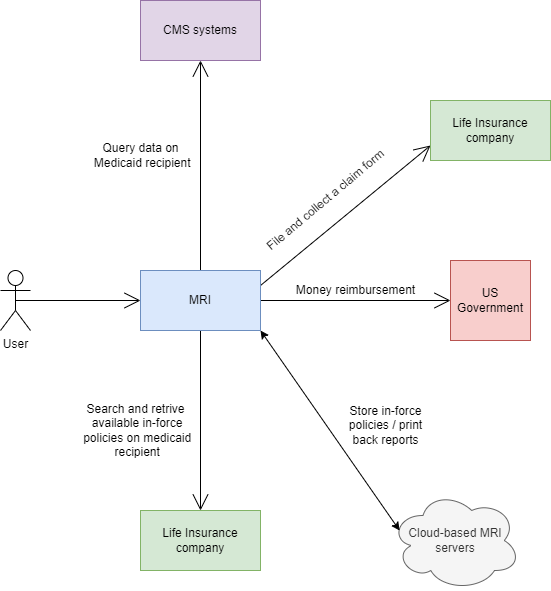
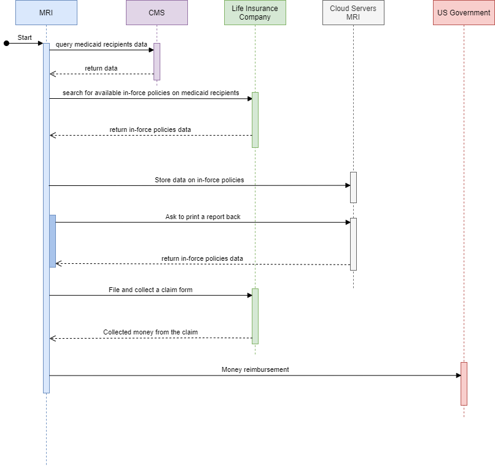
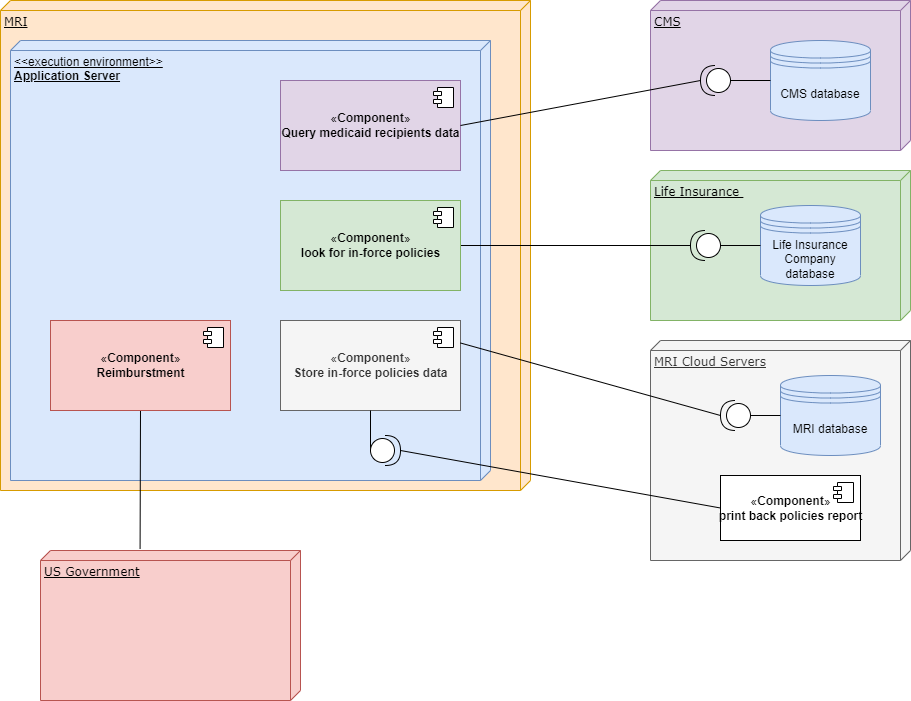
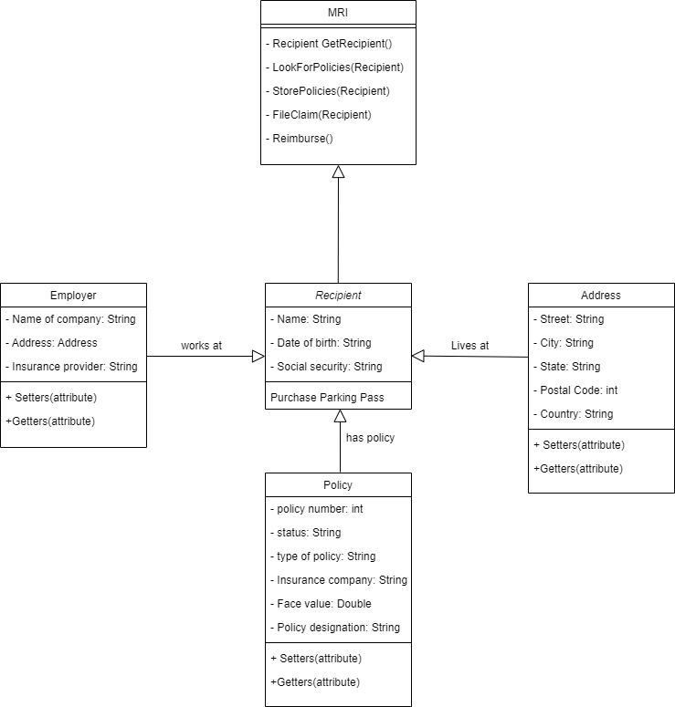

# Medicaid Recovery Insurance System (MRI)

(MRI) is a company that seeks to develop proprietary software to bridge the gap between the Medicaid System and the life insurance industry to recover proceeds from life and annuity policies, within the five-year look-back period, on behalf of the Medicaid system. So, they can reimburse it back to the government and save, potentially, thousands, if not millions, of dollars to tax payers.

# Software Overview:

The software will be designed as follows:

1. MRI intakes the required data to interface with the insurance industry from the state or the federal Center for Medicare & Medicaid Services (CMS).

2. MRI will query between all life and annuity insurance companies to determine if there are any in-force policies on the Medicaid recipient. These policies are Known Policies (policies disclosed at the time of intake), are Known Policies (policies disclosed at the time of intake), Manipulated Policies (policies transferred to a third party within the five-year Look-Back Period), or Orphaned Policies.

3. After determining there are in-force policies, MRI will then analyze the in-force policies to determine the appropriate disposition that will best serve the interest of the Medicaid program.

4. MRI will also warehouse the data and generate monthly reports to the state and or federal CMS.

5. Finally, when a Medicaid recipient passes away, MRI will be notified by the appropriate agency, and MRI will initiate the claim process on behalf of the Medicaid system per SAS 70 protocol.

## Diagrams

Some of the diagrams we did during our design phase even though they are actually not 100% accurate to the final product:

Use Case:  
 
Sequence Diagram:  
 
Deployment Diagram:  
  
Class Diagram:  
  

## Getting Started

In order to get the program running in your computer in IntelliJ you need to follow the next steps:
1. Copy the URL for this repository.
2. Open IntelliJ.
3. Close any projects that you might have open at the time.
4. Click on "Get from Version Control".
5. Make sure that on the left side you have selected "Repository URL", and in the choice box for "Version Control" on top is selected "Git".
6. Paste the URL of the repository where says "URL" and click "Clone".
7. After it is cloned, go to OOP>src>main>java and right click the "Main" class and click on "Run 'Main.main()'".
8. Finally, if the program does not run, go to "Run" on the menu bar on top. Then, click on "Edit Configurations" and paste this into the "VM Options" text box:

                      --module-path C:\Users\ronal\javafx-sdk-11.0.2\lib --add-modules javafx.controls,javafx.fxml 
                      
 (but include the directory where is located your javafx.lib. in your computer.)
 9. Then right click Main and run it again, and it should run smoothly.  
## Built With
* JavaFX project using Java 11.
* IDE: IntelliJ IDEA Ultimate version 2020.2 
* H2 Database Engine version 1.4.200 (2019-10-14)
* SceneBuilder for Java 11 version 11.0.0  

## Contributing
Because of the timespan and because we did not have the actual data of medicaid recipients and insurance companies there were many things that my partner (Jean Paul Mathew) and I (Ronald Quiroz) have to leave out and made a few assumptions instead. Thus, the program still has much room for improvement. We design a main functional demo for our sponsor Terrance Gilbert to show to professional software engineers so they can develop a better version of what we just built. Otherwise, he can choose to give it to another group of students to keep working on it.  

## Author

* Ronald Quiroz.
* Jean Paul Mathew.
* Terrance Gilbert (Sponsor from MRI).

## License

[License](LICENSE)  

## Acknowledgments

* My partner Jean Paul Mathew deserves credit for working on this with me.
* I appreciate the help of my sponsor Terry for all his guidance through the semester.

## History

This is the completed version after a semester of putting together small parts of the program at a time.

## Key Programming Concepts Utilized
* Object Oriented Programming: programming base on objects created with a particular behavior.  
* Enum: A group of constants variables.  
* Abstract Class: A class that cannot be instantiated, but it can be referenced. So, we can talk about this class, but we cannot create objects of this class.  
* Overring methods: A method in a subclass with the same name, parameters and return type as a method in its super class.  
* Overloading methods: Two methods with the same name, but different parameters.
